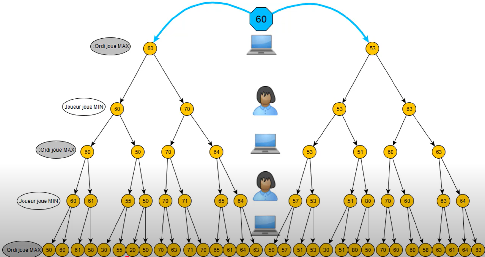
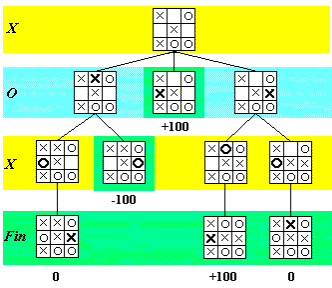

# 🏁 Jeu d’Échecs avec IA Min-Max
*Projet personnel pour implémenter un moteur d’échecs en Python avec une IA basée sur Min-Max + élagage alpha-bêta.*

---


# 1. Algorithme Min-Max
**Principe** : L’IA explore tous les coups possibles en alternant entre :
- **Niveau Max** (elle cherche à maximiser son score).
- **Niveau Min** (l’adversaire cherche à minimiser son score).



On a ici un arbre binaire de profondeur 5, c'est à dire que l'ia à le choix entre deux coup à chaque fois et voit 5 coup en avance. Le numéro dans les bulle correspond au résultat de la fonction d'évaluation calculé avec la fonction dévaluation que j'expliquerer après. A chaque fois que l'**adversaire** (joueur) joue on fait remonter le **pire** score ainsi on évite que l'ia fasse un coup **qui l'a mettrait par la suite en danger**. Mais quand c'est à l'ia (ordi) de jouer on fait remonter le **meilleur score**. D'ou le nom algorythme MinMax !


## Exemple pour un morpion

Avec un morpions on a plus un arbre bianire le nombre de possibilité dépend de la ou nous en sommes dans la partie. Ici on donne dans la fonction dévaluation 100 si l'ia gagne -100 si l'ia perd et 0 si il ni a ni gagnant ni perdant. On va voir l'algorythme sur les 3 dernier coups d'une partie



On voit ainsi que faire remonter le min à permis de ne pas choisir un coup qui aurait causé la défaite. Et faire remonter le max permet de voir les cas de victoire. On peut égelment changer la fonction d'évaluation pour avantager les victoires proches par exemple.


### Exemple de code pour un morpion :

```python
def minmax(plateau: List[List[str]], profondeur: int, est_max_joueur: bool) -> int:
    freeCell = coups_possibles(plateau)

    if profondeur == 0 or gagnant(plateau) is not None or plateau_plein(plateau):
        return evaluer(plateau, profondeur)
    

    if est_max_joueur:
        best_score = -float('inf')
    else:
        best_score = float('inf')
    
    if est_max_joueur:
        for move in freeCell:
            new_tabl = jouer_coup(plateau, move, X)
            score = minmax(new_tabl, profondeur - 1, not est_max_joueur)
            best_score = max(score, best_score)
            
    else:
        for move in freeCell:
            new_tabl = jouer_coup(plateau, move, O)
            score = minmax(new_tabl, profondeur - 1, not est_max_joueur)
            best_score = min(score, best_score)
        
    return best_score
```

On utilise la **récursivité** pour parcourir les plateaux de simulation à une profondeur voulu. Une fois arriver à la profondeur voulu on **évalue** puis on fait remonter le score et on le **compare** avec les autres position de son niveau grace à la boucle for. A chaque fois en faisant attention de si il s'agit d'**un tour min ou d'un tour max** !

## Mon implémentation pour le jeu d'echec** :
- Profondeur limitée à **2 coups** (pour éviter l’explosion combinatoire).
- Utilisation de **récursivité** avec une fonction `minMax(self, color, board, deep, IS_MAX = True)`.


# 2. Fonction d'évaluation
La fonction évaluation est au coeur de prise de déscision d'un ia. Elle aura pour unique but de retourné un score évaluant le plateau entier en fonction de la couleur de l'ia.
Pour les echecs cela peut être une évaulation selon :
- la **valeur** des pièces
- selon le **positionnement** des pièces


## Evaulation en fonction de la valeur :

On attribut une valeur selon la **force des pièces**. Une dame est plus importante qu'un pion par exemple

### exemple d'attribution de points selon la valeur
```python
points = {
            "p": 100,
            "n": 320,
            "b": 330,
            "r": 500,
            "q": 900,
        }
```


## Evaulation en fonction du positionnement :

Ici il sera question de donnée manuellement un **score** pour chaque cases du tableau importantes à maitrisées pour une **pièce donnée**.
Par exemple pour un **pion**, il sera important de maitrisée le **centre** ou alors de s'**aporocher des dernières lignes** pour faire une dame. On va donc donner un nombre plus important de point à ces cases qu'à des case moins avantageuse comme celles qui **enlèvent la protection du roi**, celle-ci auront même un **malus**.

### Exemple de tableau de points de positionnement d'un pion
```python
pawn_position_bonus = [
            [0,  0,  0,  0,  0,  0,  0,  0],  # Ligne 0 (promotion)
            [50, 50, 50, 50, 50, 50, 50, 50],  # Ligne 1
            [10, 10, 20, 30, 30, 20, 10, 10],  # Ligne 2
            [5,  5, 10, 25, 25, 10,  5,  5],   # Ligne 3
            [0,  0,  0, 20, 20,  0,  0,  0],   # Ligne 4
            [5, -5,-10,  0,  0,-10, -5,  5],   # Ligne 5
            [5, 10, 10,-20,-20, 10, 10,  5],   # Ligne 6
            [0,  0,  0,  0,  0,  0,  0,  0]    # Ligne 7
        ]
```
### Exemple de tableau de points de positionnement d'un cavalier
```python
knight_position_bonus = [
            [-50,-40,-30,-30,-30,-30,-40,-50],
            [-40,-20,  0,  0,  0,  0,-20,-40],
            [-30,  0, 10, 15, 15, 10,  0,-30],
            [-30,  5, 15, 20, 20, 15,  5,-30],
            [-30,  0, 15, 20, 20, 15,  0,-30],
            [-30,  5, 10, 15, 15, 10,  5,-30],
            [-40,-20,  0,  5,  5,  0,-20,-40],
            [-50,-40,-30,-30,-30,-30,-40,-50]
        ]
```
Son but à lui sera de maitriser le plus de case possible

Plus une pièce **maitrise de case plus elle est puissante** au echec. J'ai donc fait un **calul du total de coup jouable** et avantagé une ia qui a plein de possibilité. Elle sera par contre pénalisé si elle laisse l'adversaire se développer.
### Exemple de code récompansant les pièces dégagées
```python
# Bonus pour la mobilité (nombre de coups légaux) Une piece avec beaucoup 
# de posibilité de déplacement sera plus forte qu'une avec moins
my_pieces = board.get_all_playable_pieces(color)
my_moves = 0 # = Total de moves que l'on peut faire
for x, y in my_pieces:
    moves = board.get_legal_moves((x, y))
    for move in moves:
        my_moves += 1

opponent_pieces = board.get_all_playable_pieces(opponent_color)
opponent_moves = 0
for x, y in opponent_pieces:
    moves = board.get_legal_moves((x, y))
    for move in moves:
        opponent_moves += 1

score += (my_moves - opponent_moves) * 2
```